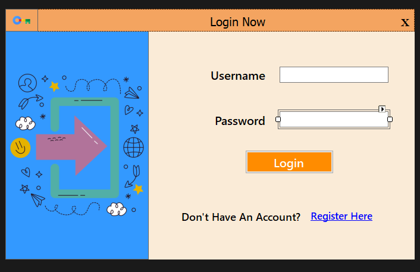
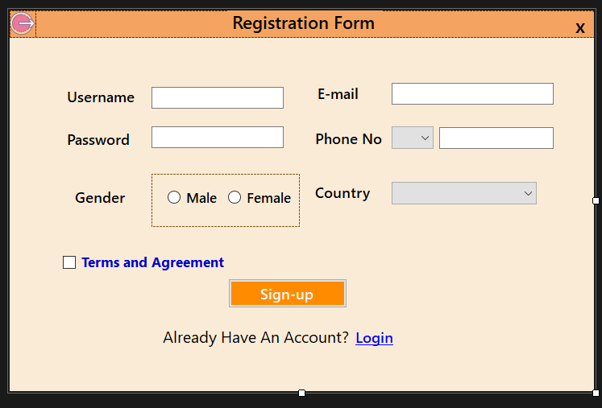

# 📘 Course Detail Management System

A simple Windows Forms application developed in C# to manage course-related data, including login, registration, and course information screens. This project demonstrates basic CRUD operations, form navigation, and database integration using SQL Server.

---

## 🚀 Features

- ✅ User Login and Registration System
- 📚 Course Information Input and Display
- 🛠️ SQL Server Integration
- 💾 Save, Edit, Delete, and View Course Records
- 🖼️ Clean and user-friendly interface

---

## 🧰 Technologies Used

- C# (.NET Framework)
- Windows Forms (WinForms)
- Microsoft SQL Server
- Visual Studio
- Git & GitHub

---

## 📸 Screenshots

### 🔐 Login Screen


### 📝 Registration Form


### 🎓 Course Dashboard


---

## ⚙️ How to Run

1. Clone this repository:
   ```bash
   git clone https://github.com/Expert610/course-detail.git
